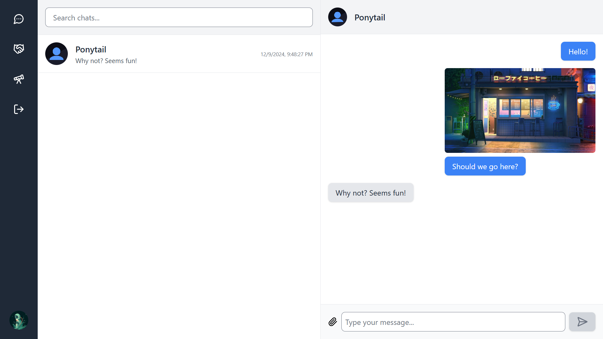

# Messaging App Frontend

## About

React frontend for a web-based messaging app where authenticated users can chat one-one by sending and receiving messages and files.




## Features

### Authentication

- Sign up
- Sign in
- Sign out

### Profile

Users have full profiles with information such as usernames, display names, DP, and more. It's visibility is based on friendship status.

- View others profiles
- Edit your own profile


### Explore

- Explore new people from the app

### Friendship Management
 
- Send friend requests 
- Accept friend requests
- View incoming and outgoing friend requests
- View all friends
- View more profile info

### Chats

- Start a new chat with anyone
- Open an existing chat
- View all chats
- View all chat messages
- Send text messages in chat
- Send files in chat

## Future Improvements

- **Responsive**: The app is currently not responsive on small devices.
- **Groups**: Allow users to create and send messages in groups.
- **Friendship**: Improve friendship management, such as allowing users to end friendships, cancel outgoing friend requests, and decline incoming friend requests.
- **Chats & Messages**: Allow deleting of chats/messages.


## Getting Started

### Clone Repository

```
git clone https://github.com/4bdullah7eeshan/messaging-app-frontend.git
cd messaging-app-frontend
```

### Install Dependencies & Start Client

```
npm install
npm run build
npm run preview
```

## Background

This project was created as part of [The Odin Project](https://www.theodinproject.com/)'s [Messaging App](https://www.theodinproject.com/lessons/nodejs-messaging-app) project.


